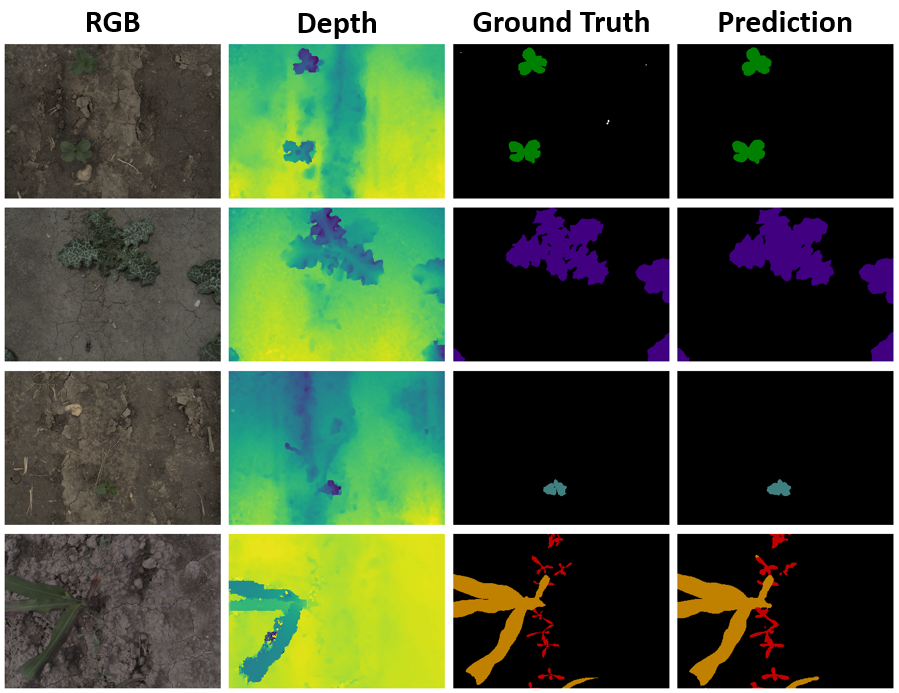

# ESANet for WE3DS: An RGB-D Image Dataset for Semantic Segmentation in Agriculture

This repository contains the extension of the 
[ESANet](https://github.com/TUI-NICR/ESANet) model for Efficient RGB-D Semantic
Segmentation on the WE3DS RGB-D image dataset.

[](https://doi.org/10.5281/zenodo.7457983)



## License and Citations
The source code is a modified version of the work by Seichter and Köhler that can be found on
[GitHub](https://github.com/TUI-NICR/ESANet). It is published under BSD 3-Clause license, 
see [license file](LICENSE) for details. Modifications are highligthed in the source files and
are just intended to include the WE3DS dataset related code. The source code in 
[we3ds](../src/datasets/we3ds) was added by Kitzler to include download and pre-processing of the 
WE3DS dataset for using it together with the ESANet.

If you use the WE3DS dataset, please cite the following paper:
> Kitzler, F., Barta, N., Neugschwandtner, R.W., Gronauer, A., Motsch, V.
*WE3DS: An RGB-D Image Dataset for Semantic Segmentation in Agriculture*
in Sensors, 2023, 23
```bibtex
@article{kitzler2023we3ds,
  author         = {Kitzler, Florian and Barta, Norbert and Neugschwandtner, Reinhard W. and Gronauer, Andreas and Motsch, Viktoria},
  journal        = {Sensors},
  title          = {WE3DS: An RGB-D Image Dataset for Semantic Segmentation in Agriculture},
  year           = {2023},
  issn           = {1424-8220},
  number         = {5},
  volume         = {23},
  article-number = {2713},
  doi            = {10.3390/s23052713},
  pubmedid       = {36904917},
  url            = {https://www.mdpi.com/1424-8220/23/5/2713},
}
```

If you use the source code (original or modified), or the network weights, please cite the 
following paper:
>Seichter, D., Köhler, M., Lewandowski, B., Wengefeld T., Gross, H.-M.
*Efficient RGB-D Semantic Segmentation for Indoor Scene Analysis*
in IEEE International Conference on Robotics and Automation (ICRA), pp. 13525-13531, 2021.

```bibtex
@inproceedings{esanet2021icra,
  title={Efficient RGB-D Semantic Segmentation for Indoor Scene Analysis},
  author={Seichter, Daniel and K{\"o}hler, Mona and Lewandowski, Benjamin and Wengefeld, Tim and Gross, Horst-Michael},
  booktitle={IEEE International Conference on Robotics and Automation (ICRA)},
  year={2021},
  volume={},
  number={},
  pages={13525-13531}
}

@article{esanet2020arXiv,
  title={Efficient RGB-D Semantic Segmentation for Indoor Scene Analysis},
  author={Seichter, Daniel and K{\"o}hler, Mona and Lewandowski, Benjamin and Wengefeld, Tim and Gross, Horst-Michael},
  journal={arXiv preprint arXiv:2011.06961},
  year={2020}
}
```
## Original Repository

- [ESANet.md](ESANet.md): This file contains the documentation of the original work by Seichter et al. 

## Training of ESANet on WE3DS dataset

1) Follow the instructions given in [ESANET](../ESANet.md) to set up a virtual environment with the needed packages.

2) Make sure you downloaded and pre-processed the WE3DS dataset, follow
instructions given in [we3ds](../src/datasets/we3ds).

3) Train ESANet-R34-NBt1D on WE3DS:
    ```bash
    python train.py \
        --dataset we3ds \
        --dataset_dir ./datasets/we3ds \
        --pretrained_dir ./trained_models/imagenet \
        --results_dir ./results \
        --epochs 1500
    ```